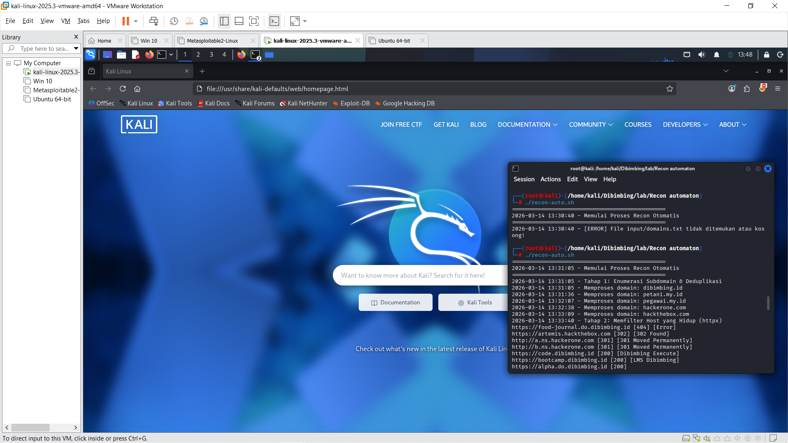

# 🛡️ Recon Automation Tool

Proses penggunaan reconnaisance berdasarkan skrip Bash bisa dengan menggunakan skrip yang telah disediakan. Namun, ProjectDiscovery Tools sangat wajib ada.

---

## 🚀 Environment Setup

Proyek ini memerlukan **Go** and **pdtm** (ProjectDiscovery Tool Manager) agar bisa diinstal dengan mudah.

### 1. Install pdtm
```bash
go install -v [github.com/projectdiscovery/pdtm/cmd/pdtm@latest](https://github.com/projectdiscovery/pdtm/cmd/pdtm@latest)

```

### 2. Install Tools

Gunakan `pdtm` untuk instalasi `subfinder` dan `httpx`, dan lakukan instalasi manual untuk `anew`:

```bash
# Install subfinder dan httpx via pdtm
pdtm -i subfinder,httpx

# Install anew secara manual via Go
go install -v [github.com/tomnomnom/anew@latest](https://github.com/tomnomnom/anew@latest)

```

*Note: Pastikan Go bin folder (biasanya `~/go/bin`) termasuk ke dalam sistem `$PATH`.*

---

## 🛠️ Run the Script

1. **Clone the repository** (atau buat folder baru) and tempatkan `recon-auto.sh` di dalam.
2. **Buat file input** di folder input:
```bash
echo "google.com" > domains.txt

```


3. **Set permissions** dan eksekusi:
```bash
chmod +x recon-auto.sh
./recon-auto.sh

```


---

## 📂 Contoh Input & Output

Skrip ini menggunakan 3 direktori.

### **Input (`domains.txt`)**

```text
google.com
example.com

```

### **Output (`live.txt`)**

```text
[https://www.google.com](https://www.google.com) [200] [Google]
[https://mail.google.com](https://mail.google.com) [200] [Gmail]
[http://example.com](http://example.com) [200] [Example Domain]

```

---

## 🔍 Code Logic Explained

| Section | Description |
| --- | --- |
| **Subfinder** | Melakukan recon pasif terhadap domain. |
| **Anew** | Berfungsi sebagai filter dari subdomain yang baru. |
| **httpx** | Untuk probing dan bannergrabber beserta statusnya. |

---

## 📸 Terminal Screenshots


### **Execution Flow**


Ketika perintah dijalankan, maka secara otomatis akan memulai enumerasi.

### **Final Results (`live.txt`)**
(Screenshot/hasil live.png)
Hasilnya.

```
